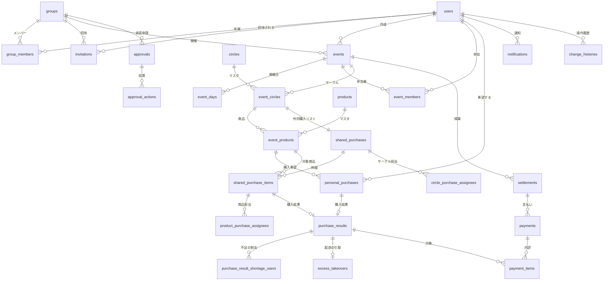
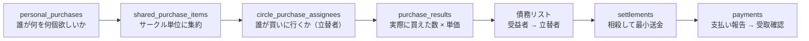

# ER図（データベース設計）

コミケ共同購入管理Webサイトのテーブル構成。
Mermaid記法のため、GitHub・VS Code・Notionでそのまま図として表示できる。

## 1. 全体像



## 2. 立替と精算をどう表現しているか

このアプリの中心は「誰が、誰の分を、いくら立て替えたか」を復元できることにある。
そのために **金額を持つのは `purchase_results` だけ** にして、精算はそこから導出している。



| 段階 | 保持するもの | 導出方法 |
| --- | --- | --- |
| 希望 | `personal_purchases.planned_quantity` | 参加者が入力 |
| 集約 | `shared_purchase_items.planned_quantity` | 希望の合計（`syncSharedPurchaseFromWishes`） |
| 立替者 | `purchase_results.purchase_assignee_user_id` | 確定した購入担当者。**訂正しても変えない** |
| 債務 | （テーブルなし） | `SettlementService::debts()` が結果から毎回計算 |
| 送金 | `settlements` | 債務を人ごとに相殺し、送金回数を最小化して生成 |
| 支払 | `payments` / `payment_items` | 報告と受取確認の2段階。内訳を商品まで辿れる |

**不足と超過**

- 予定より少なかった場合 → `purchase_result_shortage_users` に「誰の分が何個足りないか」を記録し、その人の債務から差し引く
- 予定より多かった場合 → `excess_takeovers` に「超過分を誰が引き取るか」を記録し、その人の債務に足す
- 両者は `max(0, …)` で相補的なので、同じ明細に同時に発生しない

## 3. 主要テーブル

### ユーザーとグループ

| テーブル | 役割 | 要点 |
| --- | --- | --- |
| `users` | アカウント | ログインは `user_id`（英小文字+数字5〜15）。退会はソフトデリート |
| `groups` | グループ | ソフトデリート |
| `group_members` | 所属 | `role`（最高責任者/責任者/一般メンバー）、`left_at` で脱退を表す。**行は消さない**ので再加入で履歴が残る |
| `invitations` | 招待 | `status`（pending/accepted/declined/cancelled） |

`group_members` に `left_at` を持たせているため、**在籍判定は必ず `isActiveMember()` / `roleOf()` を通す**こと。
`->members()` を直接使うと脱退者が混ざる。

### イベントとカタログ

| テーブル | 役割 | 要点 |
| --- | --- | --- |
| `events` | イベント | `status` は6段階（準備中→受付中→確定済→開催中→精算中→完了）。`fixed_at` でロック時刻 |
| `event_days` | 開催日 | 複数日開催に対応。`events.starts_at/ends_at` は全日程の外側 |
| `event_members` | 参加表明 | 参加していない人は確定後のイベントを閲覧できない |
| `circles` / `event_circles` | サークル | イベント内で完結。`display_name` で同名重複を検知。`booth`・`map_x/map_y` を持つ |
| `products` / `event_products` | 商品 | `price` は円単位の整数。`status`（頒布あり/頒布終了など） |

### 購入と精算

| テーブル | 役割 | 要点 |
| --- | --- | --- |
| `personal_purchases` | 個人の購入希望 | `(event_id, event_product_id, user_id)` で一意 |
| `shared_purchases` | サークル単位の共同購入リスト | `(event_id, event_circle_id)` で一意 |
| `shared_purchase_items` | 商品ごとの明細 | 希望の合計数 |
| `circle_purchase_assignees` | サークルの購入担当 | `confirmed_at` が入って初めて確定。立候補は `confirmed_at = NULL` |
| `product_purchase_assignees` | 商品単位の分担 | 1サークルを複数人で分ける場合 |
| `purchase_results` | 購入結果 | 個人分か共同分かは `personal_purchase_id` / `shared_purchase_item_id` の**どちらか一方だけ**が入る（CHECK制約） |
| `settlements` | 送金1件 | `payer → payee` に `amount` 円。`status`（pending/completed） |
| `payments` / `payment_items` | 支払い | `payment_items` で「この支払いに含まれる商品と金額」を持つ |

### 承認・通知・履歴

| テーブル | 役割 | 要点 |
| --- | --- | --- |
| `approvals` | 承認申請 | 対象は多態（`approvable_type/id`）。`action_type`（確定/完了/再オープン/内容変更の解禁） |
| `approval_actions` | 投票 | `(approval_id, actor_user_id)` で一意。1人1票 |
| `notifications` | アプリ内通知 | `payload` は JSON。`read_at` で既読管理 |
| `change_histories` | 変更履歴 | `changes` は JSON。イベント単位で一覧表示する |

## 4. 金額を守るための制約

| 制約 | 目的 |
| --- | --- |
| `purchase_results` の CHECK | 個人分と共同分を同時に指すレコードを作らせない |
| 金額列は `unsigned` | マイナスの金額を物理的に作れない |
| `settlements` の外部キーは `RESTRICT` | 精算が残ったままイベントや参加者を消せない |
| `personal_purchases` の複合ユニーク | 同じ人が同じ商品に二重の希望を持てない |
| `circle_purchase_assignees` の複合ユニーク | 同じ人が同じサークルに二重登録されない |

## 5. 索引

| テーブル | 索引 | 用途 |
| --- | --- | --- |
| `settlements` | `(event_id, status)` | イベントの精算一覧 |
| `settlements` | `(payer_user_id, status)` / `(payee_user_id, status)` | グループ横断の「未精算のまとめ」 |
| `payments` | `(payer_user_id, status)` / `(payee_user_id, status)` | 自分の支払い状況 |
| `notifications` | `(user_id, read_at)` | 未読バッジ |
| `approvals` | `(group_id, status)` | 承認待ちの検索 |

## 6. マイグレーションの順序

```
0001_01_01_000000  users / password_reset_tokens / sessions
0001_01_01_000001  cache
0001_01_01_000002  jobs
2026_08_17_000000  users に user_id / deleted_at を追加
2026_08_17_000001  groups / group_members / invitations
2026_08_17_000002  events / event_days / event_members / circles / event_circles / products / event_products
2026_08_17_000003  purchases 系（希望・共同・担当・結果・不足・超過）
2026_08_17_000004  payments / payment_items / settlements / approvals / approval_actions / notifications / change_histories
2026_08_18_000000  users.user_id を必須に
2026_08_22_000000  memos テーブルを削除
2026_08_22_000001  circle_purchase_assignees に confirmed_at
2026_08_22_000002  payments を精算フローに合わせて調整
2026_08_22_000003  notifications に read_at
2026_08_23_000000  settlements に未精算検索用の索引
```
