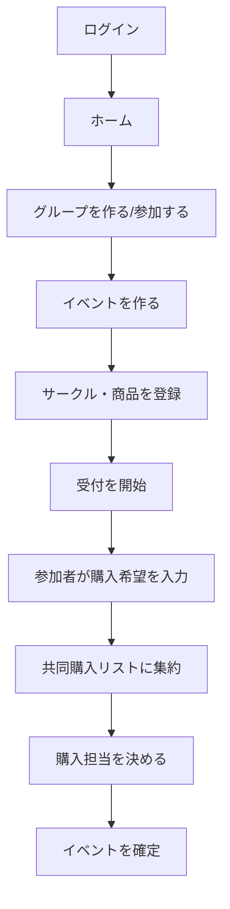
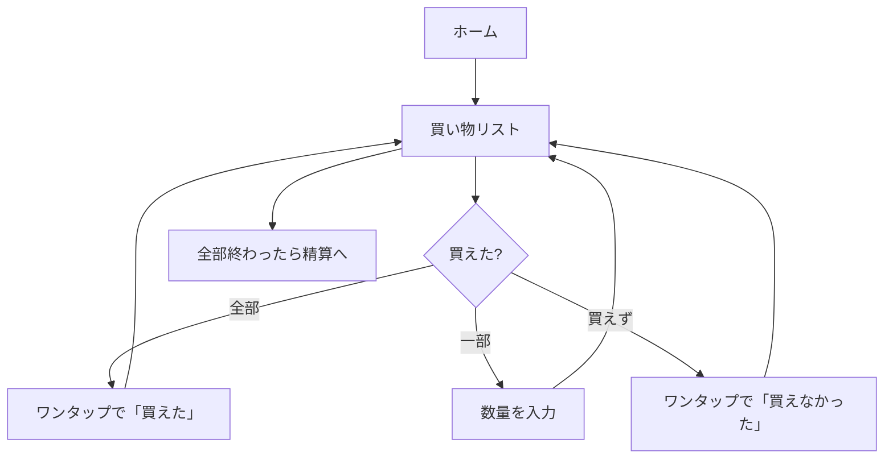
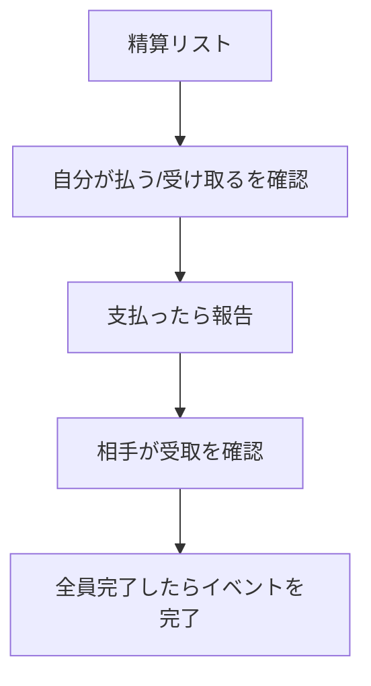

# 画面設計

**前提**: 会場では人混みの中で立ったまま、片手でスマホを操作する。
そのため全画面をモバイルファースト（幅360〜390px基準）で設計し、
タップ領域は最小40px、主要操作は親指の届く下半分に置く。

## 1. 画面構成の骨格

すべての画面が同じ枠を共有する（`components/app-layout.blade.php`）。

```
┌─────────────────────────────┐
│ [←] 画面タイトル      [操作] │ ← 上部固定バー（高さ56px）
├─────────────────────────────┤
│                             │
│   本文（縦スクロール）        │
│   ・カード単位で区切る        │
│   ・横スクロールは作らない     │
│                             │
├─────────────────────────────┤
│ ホーム グループ お知らせ ｱｶｳﾝﾄ │ ← 下部固定ナビ（safe-area対応）
└─────────────────────────────┘
```

- 上部バー: 戻る（`:back`）／タイトル／画面固有の操作（編集など）
- 下部ナビ: 4タブ固定。お知らせには未読バッジ
- フラッシュメッセージは本文先頭に `x-alert` で表示し、数秒で自動的に消える

## 2. 利用シナリオと画面の流れ

### 事前準備（自宅・PCでもスマホでも）



### 当日（会場・立ったまま片手）



### 精算（帰宅後）



## 3. 画面一覧

### 認証（`resources/views/auth/`）

| 画面 | 目的 | モバイル上の要点 |
| --- | --- | --- |
| ログイン | ログインID＋パスワード | 入力欄は2つだけ。`autocomplete` を正しく指定してパスワード管理アプリが効くようにする |
| 新規登録 | アカウント作成 | ログインIDの規則をその場に書く。エラーは各欄の下に出す |
| パスワード再設定（申請／実行） | 再設定 | 存在しないアドレスでも同じ文言を返す |
| メール認証の案内 | 認証待ち | 再送ボタンのみ |

### ホーム（`dashboard.blade.php`）

当日と平常時の入口を1画面に集約する。

```
┌─────────────────────────────┐
│ 共  ホーム                   │
├─────────────────────────────┤
│ ┌─────────────────────────┐ │
│ │ (ア) 主催 太郎           │ │  自分
│ │      @owner001          │ │
│ └─────────────────────────┘ │
│ やること                 [3] │  ← 対応が必要なものだけ
│ ┌─────────────────────────┐ │
│ │ 支払う                 › │ │
│ │ 責任 花子 さんへ ¥1,800  │ │
│ └─────────────────────────┘ │
│ ┌─────────────────────────┐ │
│ │ 未精算のまとめ         › │ │  ← グループ横断の合計
│ │ [支払う ¥1,800][受取 ¥0]│ │
│ └─────────────────────────┘ │
│ 進行中のイベント              │
│ ┌─────────────────────────┐ │
│ │ コミックマーケット105     │ │
│ │ 東京ビッグサイト  [受付中]│ │
│ └─────────────────────────┘ │
│ 参加中のグループ              │
└─────────────────────────────┘
```

「やること」は `UserTaskService` が集約する。未返答の招待・未入力の購入希望・
未登録の購入結果・未払いの精算・承認待ち・責任者不在をここに出す。

### グループ（`groups/`）

| 画面 | 目的 |
| --- | --- |
| 一覧 | 参加中のグループ。役割バッジ付き |
| 詳細 | メンバー、役割変更、招待、イベント一覧への導線 |
| 作成／編集 | 名称・説明・画像 |
| ユーザー検索 | 招待相手をログインIDで探す（2文字以上） |

### イベント（`events/`）

| 画面 | 目的 |
| --- | --- |
| 一覧 | 開催予定と過去を分けて表示 |
| 詳細 | 状態バー（6段階）、自分の状況、各機能への入口 |
| 作成／編集 | 名称・会場・複数開催日 |
| 複製 | 前回のサークル・商品を引き継ぐ |
| 参加者 | 参加表明の状況、責任者による代理追加 |

イベント詳細の状態表示（`x-event-steps`）:

```
準備中 ─ 受付中 ─ 確定済 ─ 開催中 ─ 精算中 ─ 完了
          ●現在
```

### カタログ（`circles/` `products/`）

| 画面 | 目的 | 要点 |
| --- | --- | --- |
| サークル一覧 | 検索・並べ替え（配置順／名前順／登録順） | 配置順は会場を歩く順 |
| サークル詳細 | 配置、配置マップ画像＋目印、商品一覧 | マップはピンチで拡大できる |
| サークル登録／編集 | 名称・配置・URL・マップ画像・目印 | 同名サークルは警告してから登録 |
| 一括登録 | CSV風のテキストを貼り付け | `サークル名, 配置, 商品名, 価格` |
| 商品登録／編集 | 名称・価格・状態・画像 | |

### 購入（`purchases/`）

| 画面 | 目的 | 要点 |
| --- | --- | --- |
| 購入希望 | 自分が欲しいものと数量 | 上部に予定金額を固定表示。±ボタンは大きく |
| 希望のまとめ | 参加者全員の希望（責任者向け） | サークル別／参加者別 |
| 共同購入リスト | サークル単位の集約と担当状況 | 担当が決まっていないサークルを目立たせる |
| 共同購入の詳細 | 数量調整、担当の立候補・確定、商品単位の分担 | |

購入希望画面（当日までに入力してもらう画面）:

```
┌─────────────────────────────┐
│ ←  購入希望                  │
├─────────────────────────────┤
│ 予定金額            ¥4,600  │ ← スクロールしても残る
│ [サークル名・商品名でしぼり込み]│
├─────────────────────────────┤
│ 夏空スタジオ  東1 ア-12a      │
│   新刊イラスト集             │
│   ¥1,500        [−][ 1 ][+] │ ← タップ領域 36px 以上
│   アクリルスタンド            │
│   ¥800          [−][ 0 ][+] │
├─────────────────────────────┤
│      [ 購入希望を保存 ]      │
│ ▸ 前回の購入希望を取り込む     │
└─────────────────────────────┘
```

### 当日（`shopping/`）

**この画面がアプリの中心**。回線が細く、片手で、急いで操作する前提。

```
┌─────────────────────────────┐
│ ←  買い物リスト               │
├─────────────────────────────┤
│ ▓▓▓▓▓▓▓░░░  7/12 件         │ ← 進捗
├─────────────────────────────┤
│ ① 東1 ア-12a 夏空スタジオ     │ ← 配置順（歩く順）
│   配置マップを見る（目印あり）  │
│   新刊イラスト集 予定3点       │
│   ┌───────────┬───────────┐ │
│   │  買えた   │ 買えなかった│ │ ← 2列グリッド。折り返さない
│   └───────────┴───────────┘ │
│   一部だけ買えた（数量を入力）  │
│   ─────────────────────────  │
│   [このサークルを全部「買えた」] │
├─────────────────────────────┤
│ ② 東2 ウ-05b ねこまた工房     │
│ ...                          │
├─────────────────────────────┤
│ ☑ 買い物中は画面を消さない     │ ← Wake Lock 対応端末のみ
└─────────────────────────────┘
```

設計上の判断:

- **配置順に並べる** — `BoothSorter` がホール→ブロック→番号で並べ、会場を往復しない順にする
- **1タップで完了できる** — 予定どおり買えた場合は数量入力を求めない
- **一部だけ買えた場合も同じ画面に戻る** — `?from=shopping` を付けて、登録後に買い物リストへ戻す
- **画面を消さない** — 列に並んでいる間に画面が落ちないようにする（任意）
- **オフラインでも案内を出す** — Service Worker が専用ページを返す

### 購入結果・精算（`results/` `settlements/`）

| 画面 | 目的 | 要点 |
| --- | --- | --- |
| 購入結果 | 実績の登録・修正 | 不足の割り当て、超過の引き取り |
| 精算リスト | 誰が誰にいくら | 自分の分を先頭に。共有用テキストをコピーできる |
| 精算の内訳 | この支払いに何が含まれるか | 相殺で立替者と送金先が違う場合の説明を添える |
| 未精算のまとめ | グループ横断の残高 | ホームからも要約が見える |

精算リスト（スクショで共有しても意味が通るようにする）:

```
┌─────────────────────────────┐
│ ←  精算                      │
├─────────────────────────────┤
│ あなたが支払う                │
│ ┌─────────────────────────┐ │
│ │ (責) 責任 花子 さんへ     │ │
│ │      @leader01   ¥1,800 │ │
│ │                  [未精算]│ │
│ │ 内訳を見る               │ │
│ │ [ 支払ったことを報告する ]│ │
│ └─────────────────────────┘ │
│ 全員の精算状況                │
│  買主 → 花子      ¥1,800 未 │
│  太郎 → 花子      ¥900  済 │
│ 収支の内訳                    │
│  花子  立替¥5,400 購入¥1,800 │
│                     +¥3,600 │
│ まとめを共有する [コピーする]  │
└─────────────────────────────┘
```

### 承認・通知・履歴・アカウント

| 画面 | 目的 |
| --- | --- |
| 承認申請 | 確定・完了・再オープン・内容変更の解禁への投票、申請の取り下げ |
| お知らせ | アプリ内通知。未読フィルタとページ送り |
| 変更履歴 | イベント単位の操作ログ |
| アカウント | 表示名・メール・パスワード・退会、活動サマリー |

### エラー（`errors/`）

403 / 404 / 419 / 429 / 500 / 503 とオフライン案内。
すべて日本語で「何が起きたか」「次に何をすればよいか」を1文ずつ書く。

## 4. 共通コンポーネント

| コンポーネント | 用途 |
| --- | --- |
| `x-app-layout` / `x-guest-layout` | 画面の枠 |
| `x-card` | 情報のまとまり（角丸2xl＋白背景＋影） |
| `x-button` | ボタン。sm=40px / md=44px / lg=48px の最小高さ |
| `x-input` / `x-textarea` | ラベル・ヒント・エラーを一体で扱う |
| `x-badge` | 状態表示。色だけに頼らず必ず文字を入れる |
| `x-avatar` | 頭文字アイコン。退会者はグレー |
| `x-empty-state` | 空状態。何をすればよいかを添える |
| `x-event-steps` | イベントの6段階表示 |
| `x-paginator` | ページ送り |
| `x-behaviour` | 二重送信の防止、フラッシュの自動消去 |

## 5. 片手操作のための決めごと

| 決めごと | 理由 |
| --- | --- |
| タップ領域は最小40px（主要操作は44px以上） | 手袋・寒さ・揺れる場所でも押せる |
| 破壊的操作には必ず確認ダイアログ | 誤タップの取り返しがつかない操作を防ぐ |
| 主要な操作は画面下部に置く | 親指が届く |
| 長い名前は必ず `truncate` | 横スクロールを発生させない |
| 数量入力は `inputmode="numeric"` | 数字キーボードを出す |
| 色だけで状態を示さない | 直射日光下でも読める |
| 下部ナビは `env(safe-area-inset-bottom)` を考慮 | ホームインジケータに隠れない |

## 6. 画面の実物を確認する方法

```bash
SNAPSHOT_DIR=/tmp/pages php artisan test --filter=PageSnapshotTest
```

デモデータを投入した状態で主要26画面のHTMLを書き出す（CSSは埋め込み済み）。
ブラウザで開けばそのまま見た目を確認できる。1画面でもHTTP 200 以外になるとテストが落ちる。
